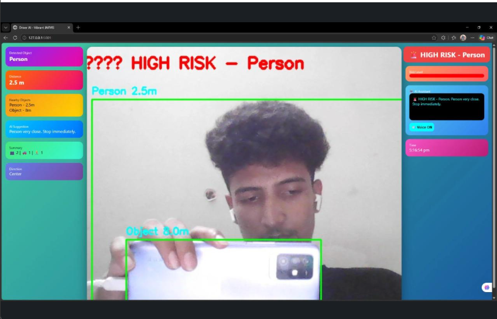
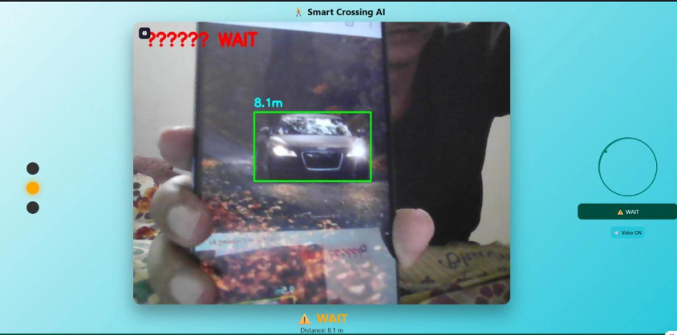

# 🚶 AI-Based Pedestrian Safety System

<p align="center">


</p>

<p align="center">
<b>Real-Time AI-Based Pedestrian Detection & Driver Safety System using YOLOv8 and Computer Vision</b>
</p>

---

# 📌 Overview

The **AI-Based Pedestrian Safety System** is a real-time computer vision application that detects pedestrians using **YOLOv8** and helps improve road safety by providing alerts to drivers and monitoring pedestrian crossings.

The project combines **YOLOv8**, **OpenCV**, and **Flask** to process live video streams, detect pedestrians, and visualize detection results through a web interface.

---

# ✨ Features

- 🚶 Real-Time Pedestrian Detection
- 🚗 Driver Safety Monitoring
- 🚦 Pedestrian Crossing Detection
- 🎥 Live Camera Support
- 📦 YOLOv8 Object Detection
- 🟢 Bounding Box Visualization
- 🌐 Flask Web Interface
- ⚡ Fast Detection Performance

---

# 🛠 Technologies Used

| Technology | Purpose |
|------------|---------|
| Python | Programming Language |
| YOLOv8 | AI Object Detection |
| OpenCV | Image Processing |
| Flask | Web Application |
| HTML | User Interface |
| CSS | Styling |

---

# ⚙️ Project Workflow

1. Capture live video from webcam.
2. Load YOLOv8 model.
3. Detect pedestrians in every frame.
4. Draw bounding boxes around detected persons.
5. Display driver-side and crossing-side monitoring.
6. Generate visual safety alerts.

---

# 📷 Project Preview

## 🚗 Driver Side Detection

<p align="center">
  
</p>

---

## 🚶 Pedestrian Crossing Detection

<p align="center">
  
</p>

---

# 📂 Project Structure

```text
AI-Based-Pedestrian-Safety-System/
│
├── templates/
│   ├── driver.html
│   └── crossing.html
│
├── driver_app.py
├── crossing_app.py
├── test.py
│
├── yolov8n.pt
├── yolov8m.pt
├── yolov8l.pt
│
├── image1 (1).png
├── image2.png
│
├── README.md
├── requirements.txt
├── LICENSE
└── .gitignore
```

---

# 🚀 Installation

Clone the repository

```bash
git clone https://github.com/Santhosh-271121/ai-pedestrian-detection.git
```

Navigate to the project

```bash
cd ai-pedestrian-detection
```

Install dependencies

```bash
pip install -r requirements.txt
```

Run Driver Side

```bash
python driver_app.py
```

Run Crossing Side

```bash
python crossing_app.py
```

---

# 📊 Applications

- 🚗 Advanced Driver Assistance Systems (ADAS)
- 🚦 Smart Traffic Management
- 🚶 Pedestrian Safety
- 🏙 Smart City Solutions
- 🚑 Accident Prevention
- 🎥 Intelligent Surveillance

---

# 🔮 Future Improvements

- Distance Estimation
- Speed Estimation
- Audio Warning System
- Multi-Camera Support
- Cloud Dashboard
- Mobile Application

---

# 👨‍💻 Author

## Santhosh C

🎓 B.Tech – Computer Science & Software Engineering (CSSE)

📊 Data Analyst | Python Developer | AI & Computer Vision Enthusiast

- 🌐 GitHub: https://github.com/Santhosh-271121
- 💼 LinkedIn: https://www.linkedin.com/in/santhosh-c-19a766335

---

<p align="center">

⭐ If you found this project useful, consider giving it a Star!

</p>
